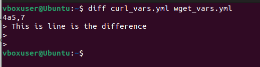
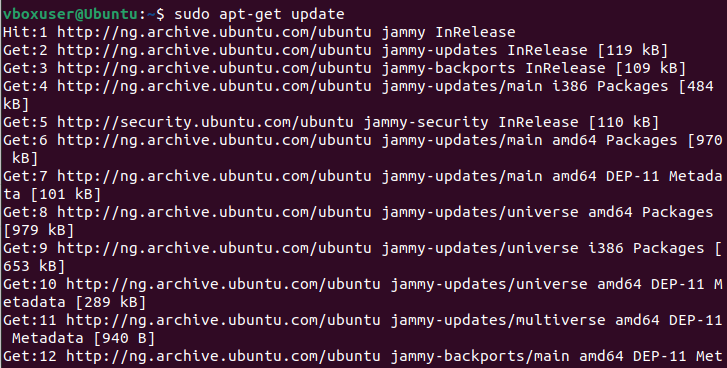

# Linux Practice Project

## Introduction to Linux and Basic Commands

The Linux command line is a text interface to the computer. All basic and advanced tasks can be done by executing commands which are executed on the Linux terminal.

A command line generally looks like this :

`CommandName [option(s)] [parameter(s)]`

### File Manipulation

**1.	Sudo command**

The sudo command allows you to run programs with the security privileges of another user (by default, as the superuser).

The general syntax is :

`sudo (command e.g apt upgrade)`

For example

`sudo apt upgrade`

**2. PWD command**

pwd stands for Print Working Directory. It prints the path of the working directory, starting from the root.

The pwd command uses the below syntax :

`pwd [option]`

 It has 2 options 

*-L (logical)	Use PWD from environment, even if it contains symbolic links*.

*-P (physical)	Avoid all symbolic links, and instead give you an absolute path*.

`pwd`

**3. cd command**

The cd command in Linux stands for change directory. It is used to change the current directory of the terminal. The terminal, by default, opens the home directory.

It uses the syntax below :

`cd CommandsLinux`

An example is shown below :

`cd Desktop`

Here are some shortcuts to help navigate the cd command :

`cd ~ [username]` *goes to another user's home directory*

`cd..` *moves one directory up*

`cd -` *moves to your previous directory*

**4. ls command**

ls is a Linux shell command that lists directory contents of files and directories. It provides valuable information about files, directories, and their attributes. Running it without a flag or parameter will show the current working directory's content.

To see other directories' content, type ls followed by the desired path. For example, to view files in the Document folder, enter :

`ls Documents`

Here are some options you can use with the ls command

`ls -R` *lists all the files in the subdirectories*

`ls -a` *shows hidden files in addition to the visible ones*

`ls -lh` *shows the file sizes in easily readable format, such as MB, GB, and TB*

**5. cat command**

Cat(concatenate) command is very frequently used in Linux. It reads data from the file and gives its content as output. It helps us to create, view, and concatenate files. To run the cat command, type cat followed by the file name and extention. For instance,

`cat learning_linux.txt`

Here are other ways to use the cat command :

`cat filename1.txt filename2.txt > filename3.txt` 

*Merges file1.txt and file2.txt and stores the output in file3.txt*

`tac file1.txt `

*Dispalys content in reverse order*

**6. cp command**

cp stands for a copy. This command is used to copy files or groups of files or directories. To copy files from the current directory to another directory, enter cp followed by the file name and the destination directory. For example,

`cp /home/vboxuser/file1.txt Desktop`

To copy the content of a file to a new file in the same directory, enter cp followed by the source and dsetination file as below :

`cp file1.txt file2.txt`

To copy an entire directory, use the R flag as shown below

`cp -R /home/vboxuser/Documents /home/vboxuser/Documents_backup`

**7. mv command**

mv command is used to move and rename files and directories. To move a file, include destination path. For example, 

`mv /home/vboxuser/Documents_backup /home/vboxuser/Documents`

mv can also be used to rename a file or folder. For example,

`mv johnbol new_folder`

**8. mkdir command**

mkdir command in Linux allows the user to create directories (also referred to as folders in some operating systems). This command can create multiple directories at once as well as set the permissions for the directories.

Here's the basic syntax

`mkdir [option] directory_name`

For example, to create a directly called music

`mkdir Music`

To make a new directory called song inside music, use the command :

`mkdir music/Songs`

**9. rmdir command**

The rmdir command removes the directory, specified by the Directory parameter, from the system. The directory must be empty before you can remove it, and you must have write permission in its parent directory.

To remove and empty dirextory from its parent directory, use the below cammand :

`rmdir /home/vboxuser/Documents/music/songs`

**10. rm command**

The rm Command rm stands for remove, and it is used to remove files, directories, and links. By default, it does not remove directories. This command normally works silently and it should be used carefully, because once you delete a file in Linux the content cannot be recovered.

Syntax : 

`rm filename`

Multiple files can be removed by running the below command :

`rm file1.txt file2.txt file3.txt`

**11. touch command**

The touch command's primary function is to modify a timestamp. Commonly, the utility is used for file creation, although this is not its primary function.

For example, to create a new_file, run the command :

`touch new_file`

**12. locate command**

The locate command is used to find a file in the database system. Morover, ading the i argument will turn off the case sensitivity, so that you can search for a file even if you don't remember it's exact name. To look for content that contains two or more words, use an asterisk (*). 

For example,

`locate -i lessons`

**13. find command**

The find command is one of the most useful Linux commands, especially when you're faced with the hundreds and thousands of files and folders on a modern computer. As its name implies, find helps you find things, and not just by filename.

General syntax :

`find [option] [path] [expression]`

For example,

`find /videos`

**14. grep command**

In Linux Systems Grep, short for “global regular expression print”, is a command used in searching and matching text files contained in the regular expressions.

For example,

`grep white colours.txt`

**15. df command**

The df command displays information about total space and available space on a file system. The FileSystem parameter specifies the name of the device on which the file system resides, the directory on which the file system is mounted, or the relative path name of a file system.

Syntax

`df [options] [file]`

For example,

`df -h`

**16. du command**

The du (disk usage) command measures the disk space occupied by files or directories. By default, it measures the current directory and all its subdirectories, printing totals in blocks for each, with a grand total at the bottom.

For example,

`du /home/vboxuser/Downloads`

**17. head command**

The head command, as the name implies, print the top N number of data of the given input. By default, it prints the first 10 lines of the specified files. If more than one file name is provided then data from each file is preceded by its file name.

Genaral syntax :

`head [option] [file]`

For example :

`head curl_vars.yml`

**18. tail command**

Tail is a command which prints the last few number of lines (10 lines by default) of a certain file, then terminates.

Genaral syntax :

`tail [option] [file]`

For example :

`tail curl_vars.yml`

**19. diff command**

diff stands for difference. This command is used to display the differences in the files by comparing the files line by line. 

Syntax :

`diff [option] file1 file2`

Example :

`diff curl_vars.yml wget_vars.yml`

**20. tar command**

The tar command is short for tape archive in Linux. This command is used for creating Archive and extracting the archive files. In Linux, it is one of the essential commands which facilitate archiving functionality.

General syntax :

`tar [options] [archive_file] [file or directory to be archived]`

Example

### File Permissions and Ownership

**21. chmod command**

The chmod command is used to change the access mode of a file. The name is an abbreviation of change mode which states that every file and directory has a set of permissions that control the permissions like who can read, write or execute the file.

General syntax :

`chmod [option] [permission] [file_name]`

For example, the owner is currently the only one with permissionto change note.txt. To allow others to read, write , and execute the file, change it to the  rwxrwxrwx permission type whose numeric value is 777 :

`chmod 777 file1.txt file2.txt`

**22. chown command**

chown command is used to change the file Owner or group. 

Basic syntax is :

`chown [option] owner[:group] file(s)`

For example, to make peter the owner of file1.txt :

`sudo chown fabian file1.txt`

**23. jobs command**

Jobs command is used to list the jobs that you are running in the background and in the foreground. If the prompt is returned with no information no jobs are present. All shells are not capable of running this command. This command is only available in the csh, bash, tcsh, and ksh shells.

Basic syntax :

`jobs [options] jobID`

To check the status of jobs in the current shell, simply enter jobs to the CLI

**24. kill command**

the kill command is used to send a signal to a process, which can be used to kill the process. The signal can be specified as a signal number or as a signal name.

To kill a program you must know its process identification number (PID). If you don't know the PID, run the below command :

`ps ux`

After knowing the PID and the signal to use, run the syntax below :

`kill [signal_option] pid`

There are 64 signals that can be used but the 2 most commonly used are :

Run Kill SIGTERM PID to terminate a program and save.

Run KILL SIGKILL PID to terminate a program without saving. 

**25. ping command**

The ping command in Linux is a utility that helps to test connectivity between two devices on a network. ping command sends a request to a specified device and waits for a response. response from device helps us to determine whether device is available or not.

General syntax :

`ping [option] [hostname_or_IP_address]`

For example, you can try to connect to Google.com and measure it's response time. 

ping google.com

**26. wget command**

wget is a free utility for non-interactive download of files from the web. It supports HTTP (hypertext transfer protocol), HTTPS, and FTP protocols, and retrieval through HTTP proxies. It is also non-interactive, meaning that it can work in the background, while the user is not logged on, which allows you to start a retrieval and disconnect from the system, letting wget finish the work. By contrast, most web browsers require constant user interaction, which make transferring a lot of data difficult.

General syntax :

`wget [option] [url]`

For example, to download the latest copy of wordpress :

`wget https://wordpress.org/latest.zip`

**27. uname command**

The uname (UNIX name) command in Linux is a simple yet powerful tool that offers information about a Linux machine's operating system and hardware platform. Sysadmins and developers use uname for troubleshooting and monitoring purposes.

General syntax :

`uname [option]`

There are acceptable options to use :

`uname -a` to determe all system information

`uname -s` to determine kernel name

`uname -n` to determine system node host 

**28. top command**

The top command is used to show the active Linux processes. It provides a dynamic real-time view of the running system. Usually, this command shows the summary information of the system and the list of processes or threads which are currently managed by the Linux kernel.

General syntax :

`top`

**29. history command**

history command is used to view the previously executed command.

General syntax :

`history [option]`

There are acceptable options to use :

`history -c` clears the complete history list

`history -d` offset deletes the history entry at the OFFSET position

`history -a` appends history lines

**30. man command**

man command in Linux is used to display the user manual of any command that we can run on the terminal. It provides a detailed view of the command which includes NAME, SYNOPSIS, DESCRIPTION, OPTIONS, EXIT STATUS, RETURN VALUES, ERRORS, FILES, VERSIONS, EXAMPLES, AUTHORS and SEE ALSO.

To display the complete manual :

`man [command_name]`

**31. echo command**

The echo command in Linux is a built-in command that allows users to display lines of text or strings that are passed as arguments. It is commonly used in shell scripts and batch files to output status text to the screen or a file.

`echo [option] [string]`

For example

`echo john`

**32. zip, unzip commands**

ZIP is a compression and file packaging utility. Each file is stored in a single .zip {.zip-filename} file with the extension .zip. Zip is used to compress files to reduce file size and is also used as a file package utility.

General syntax

`zip [options] zipfile file1 file2….`

For example, to zip a file named file1.txt

`zip archive.zip file1.txt`

On the other hand, the unzip file extracts the zip from the archive. The general syntax is as below :

`unzip [option] file_name.zip`

For example,

`unzip archive.zip`

**33. hostname command**

hostname command in Linux is used to obtain the DNS (Domain Name System) name and set the system’s hostname or NIS (Network Information System) domain name. A hostname is a name given to a computer and attached to the network. Its main purpose is to uniquely identify over a network.

General syntax :

`hostname [option]`

For example,

**34. useradd, userdel commands**

useradd is a command in Linux that is used to add user accounts to your system. It makes changes to the following files:

    /etc/passwd
    /etc/shadow
    /etc/group
    /etc/gshadow
    creates a directory for new user in /home

General syntax :

`useradd [option] username`

To set the password :

`passwd the_password_combination`

For example, to add a new user,

`useradd John`

`passwd 123456789`

To delete a user account, use the userdel command :

`userdel username`

**35. apt-get command**

apt-get is a command-line tool that helps in handling packages in Linux. Its main task is to retrieve the information and packages from the authenticated sources for installation, upgrade, and removal of packages along with their dependencies. Here APT stands for Advanced Packaging Tool.

Basic syntax :

`apt-get [options] (command)`

For example, to update to update the package lists for available software packages from the configured repositories

`sudo apt-get update`

**36. nano, vi, jed commands**

Linux allows users to to edit and manage files via a test editor such as nano, vi, or jed. nano and vi come with the operating sysytem while jed has to be installed.

General syntax,

`nano [filename]`

`vi [filename]`

jed has a drep=down menu interface that allows users to perform actions without entering keyboard combinations or commands. Like vi, it has modes to load modules or plugins to write specific texts. 

General syntax,

`jed [filename]`

**37. alias, unalias commands**

The alias command is used to customize the shell environment by generating command-line aliases. Aliases are shorthand for longer expressions. Using aliases, you can create a short string that represents a longer command with various options and arguments. For example, you can create an alias called myls that executes the ls – al command.

There are two types of aliases to create in Linux:

    Temporary. Add them using the alias command.
    Permanent. These require to edit system files.

Use the alias command to create a temporary alias that lasts until the end of the current terminal session. For instance, creating m as an alias for the mkdir command:

`alias m=mkdir`

Another use for aliases is to create a shortcut for running scripts. To do this, provide the absolute path to the script as the value. For example, 

`alias frename='Example/Test/file_rename.sh'`

To remove an alias, use the unalias command with the following syntax:

`unalias [name]`

**38. su command**

su command in linux allows a user to switch to another user account and gain all of its privileges, while sudo command in linux allows a user to execute a specific command with the privileges of another user.

General syntax

`su [options] [username [argument]]`

**39. htop command**

htop command in Linux system is a command line utility that allows the user to interactively monitor the system's vital resources or server's processes in real time. htop is a newer program compared to top command, and it offers many improvements over top command.

General syntax :

`htop [options]`

**40. ps command**

Linux provides us a utility called ps for viewing information related with the processes on a system which stands as abbreviation for “Process Status”. ps command is used to list the currently running processes and their PIDs along with some other information depends on different options. It reads the process information from the virtual files in /proc file-system. /proc contains virtual files, this is the reason it’s referred as a virtual file system. 

General syntax :

`ps [options]`

