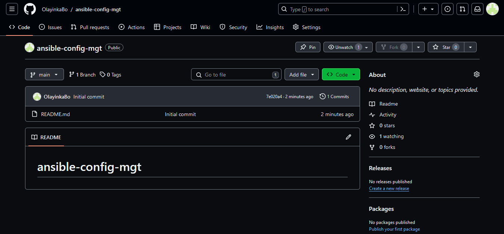
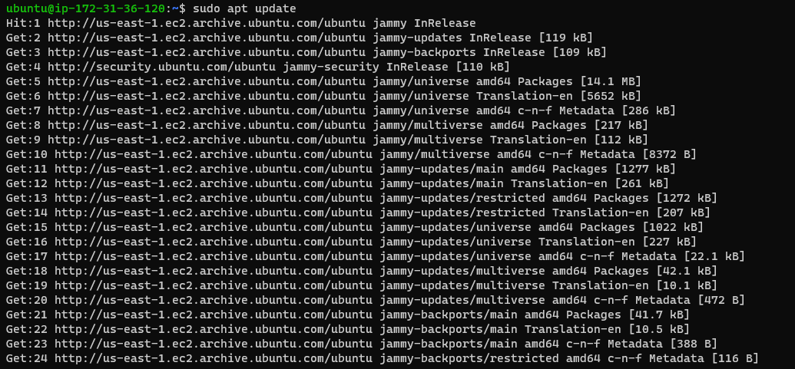
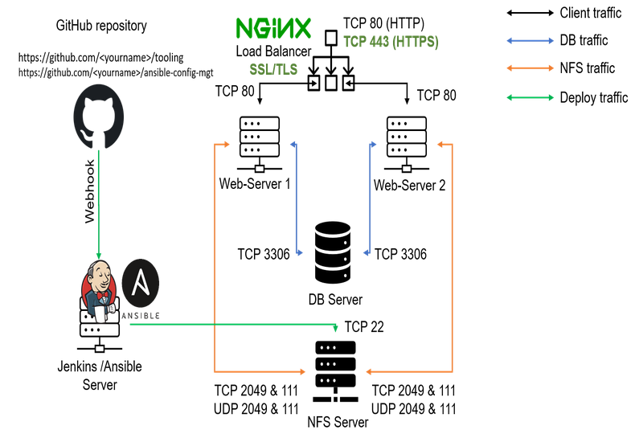
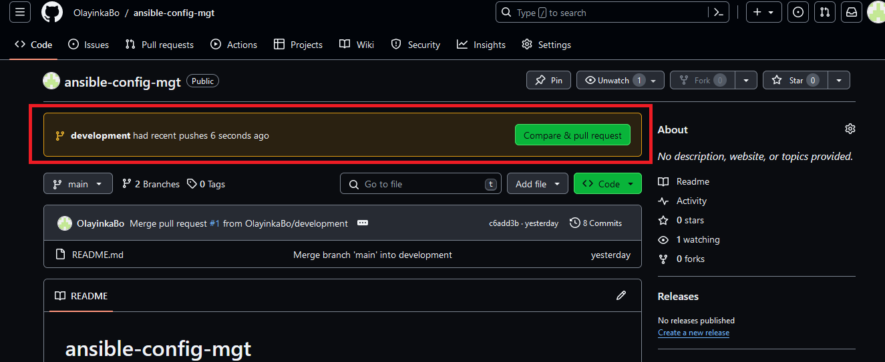
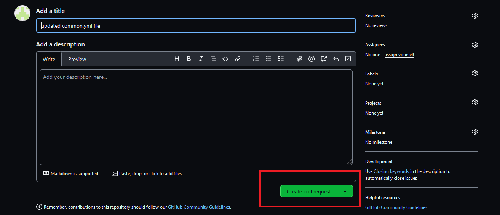
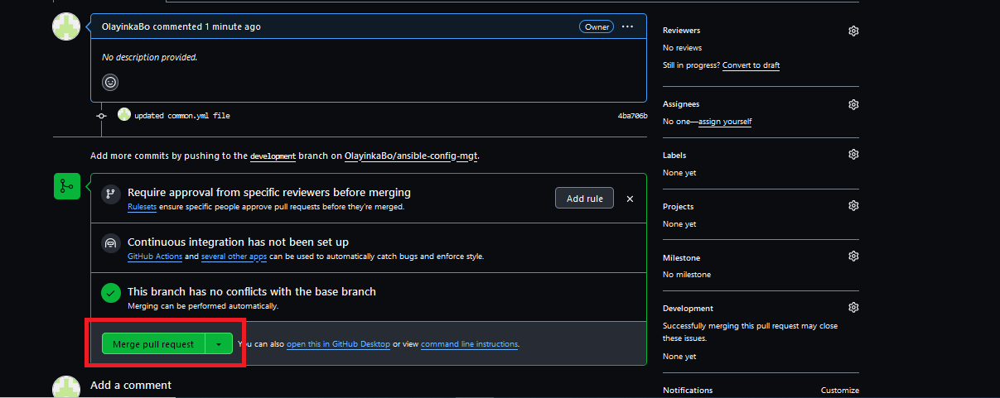
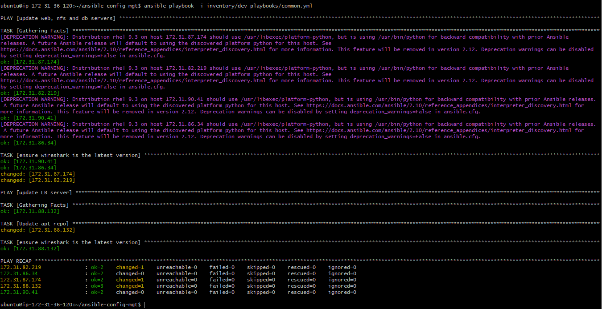

# Ansible Configuration Management

A bastion host is a server used to manage access to an internal or private network from an external network - sometimes called a jump box or jump server. 

If you think about the current architecture you are working on, ideally, the webservers would be inside a secured network which cannot be reached directly from the Internet. That means, even DevOps engineers cannot SSH into the Web servers directly and can only access it through a Jump Server - it provides better security and reduces attack surface.

On the diagram below the Virtual Private Network (VPC) is divided into two subnets - Public subnet has public IP addresses and Private subnet is only reachable by private IP addresses.


In a later project, we will see a Bastion host in proper action. But for now, we will develop **Ansible** scripts to simulate the use of a `Jump box/Bastion host` to access our Web Servers.

## Tasks

- Install and configure Ansible client to act as a Jump Server/Bastion Host
- Create a simple Ansible playbook to automate servers configuration


## Step 1 - Install and Configure Ansible on EC2 Instance

1. Update the Name tag on your Jenkins EC2 Instance to Jenkins-Ansible. We will use this server to run playbooks.


2. In your GitHub account create a new repository and name it ansible-config-mgt.



3. Install Ansible

```
sudo apt update

sudo apt install ansible
```




Check your Ansible version by running ansible --version


4. Configure Jenkins build job to archive your repository content every time you change it.


- Create a new Freestyle project ansible in Jenkins and point it to your 'ansible-config-mgt' repository.


- Configure a webhook in GitHub and set the webhook to trigger ansible build.


- Configure a Post-build job to save all (**) files. 


5. Test your setup by making some change in README.md file in master branch and make sure that builds starts automatically and Jenkins saves the files (build artifacts) in following folder. 

`ls /var/lib/jenkins/jobs/jenkins-ansible/builds/<build_number>/archive/`


**Note:** Trigger Jenkins project execution only for main (or master) branch.

Now your setup will look like this:




Every time you stop/start your Jenkins-Ansible server - you have to reconfigure GitHub webhook to a new IP address, in order to avoid it, it makes sense to allocate an Elastic IP to your Jenkins-Ansible server. 

 **Note**: The Elastic IP is free only when it is being allocated to an EC2 Instance, so do not forget to release Elastic IP once you terminate your EC2 Instance.


## Step 2 - Prepare your development environment using Visual Studio Code

1. In this project, we will use Visual Studio Code (VSC) as our source-code editor. (you are free to use any other editor of your choice). You can download VSC [here](https://code.visualstudio.com/).

2. After you have successfully installed VSC, configure it to connect to your newly created GitHub repository.

3. Clone down your ansible-config-mgt repo to your Jenkins-Ansible instance.

`git clone <ansible-config-mgt repo link>`


## Step 3 - Begin Ansible Development

1. In your ansible-config-mgt GitHub repository, create a new branch that will be used for development of a new feature.


2. Checkout the newly created feature branch to your local machine and start building your code and directory structure.


3. Create a directory and name it playbooks (for storing all your playbook files).


4. Create a directory and name it inventory (for keeping your hosts organised).


5. Within the playbooks folder, create your first playbook, and name it common.yml

Within the inventory folder, create an inventory file () for each environment (Development, Staging Testing and Production) dev, staging, uat, and prod respectively. These inventory files use .ini languages style to configure Ansible hosts.

## Step 4 - Set up an Ansible Inventory

An Ansible inventory file defines the hosts and groups of hosts upon which commands, modules, and tasks in a playbook operate. Since our intention is to execute Linux commands on remote hosts, and ensure that it is the intended configuration on a particular server that occurs. It is important to have a way to organize our hosts in such an Inventory.

Save the below inventory structure in the inventory/dev file to start configuring your development servers. Ensure to replace the IP addresses according to your own setup.

**Note:** Ansible uses TCP port 22 by default, which means it needs to ssh into target servers  from Jenkins-Ansible host - for this you can implement the concept of ssh-agent. Now you need to import your key into ssh-agent:

To learn how to setup SSH agent and connect VS Code to your Jenkins-Ansible instance, please see this video:

- For Windows users - [ssh-agent on windows](https://www.youtube.com/watch?v=OplGrY74qog)

- For Linux users - [ssh-agent on linux](https://www.youtube.com/watch?v=RRRQLgAfcJw&t=0s)

```
eval `ssh-agent -s`
ssh-add <path-to-private-key>
```


Confirm the key has been added with the command below, you should see the name of your key.

`ssh-add -l `


Now, ssh into your Jenkins-Ansible server using ssh-agent

`ssh -A ubuntu@public-ip`


Also notice, that your Load Balancer user is ubuntu and user for RHEL-based servers is ec2-user.

Update your inventory/dev.yml file with this snippet of code:

```
[nfs]
<NFS-Server-Private-IP-Address> ansible_ssh_user=ec2-user

[webservers]
<Web-Server1-Private-IP-Address> ansible_ssh_user=ec2-user
<Web-Server2-Private-IP-Address> ansible_ssh_user=ec2-user

[db]
<Database-Private-IP-Address> ansible_ssh_user=ec2-user 

[lb]
<Load-Balancer-Private-IP-Address> ansible_ssh_user=ubuntu
```

## Step 5 - Create a Common Playbook

It is time to start giving Ansible the instructions on what you need to be performed on all servers listed in inventory/dev.
In common.yml playbook you will write configuration for repeatable, re-usable, and multi-machine tasks that is common to systems within the infrastructure.

Update your playbooks/common.yml file with following code:

```
- name: update web, nfs and db servers
  hosts: webservers, nfs, db
  become: yes
  tasks:
    - name: ensure wireshark is at the latest version
      yum:
        name: wireshark
        state: latest
   

- name: update LB server
  hosts: lb
  become: yes
  tasks:
    - name: Update apt repo
      apt: 
        update_cache: yes

    - name: ensure wireshark is at the latest version
      apt:
        name: wireshark
        state: latest
```

This playbook is divided into two parts, each of them is intended to perform the same task: install wireshark utility (or make sure it is updated to the latest version) on your RHEL 8 and Ubuntu servers. It uses root user to perform this task and respective package manager: yum for RHEL 9 and apt for Ubuntu.

Feel free to update this playbook with following tasks:

- Create a directory and a file inside it
- Change timezone on all servers
- Run some shell script

For a better understanding of Ansible playbooks - [watch this video from RedHat](https://www.youtube.com/watch?v=ZAdJ7CdN7DY) and read [this article](https://www.redhat.com/en/topics/automation/what-is-an-ansible-playbook).


## Step 6 - Update GIT with the latest code

Now all of your directories and files live on your machine and you need to push changes made locally to GitHub.

In the real world, you will be working within a team of other DevOps engineers and developers. It is important to learn how to collaborate with help of GIT. In many organisations there is a development rule that do not allow to deploy any code before it has been reviewed by an extra pair of eyes - it is also called "Four eyes principle".

Now you have a separate branch, you will need to know how to raise a Pull Request (PR), get your branch peer reviewed and merged to the master branch.

Commit your code into GitHub:

1. Use git commands to add, commit and push your branch to GitHub.

```
git status

git add <selected files>

git commit -m "commit message"
```


2. Create a Pull request (PR)





3. Wear the hat of another developer for a second, and act as a reviewer.



4. If the reviewer is happy with your new feature development, merge the code to the master branch.


5. Head back on your terminal, checkout from the feature branch into the main, and pull down the latest changes.


Once your code changes appear in main branch - Jenkins will do its job and save all the files (build artifacts) to `/var/lib/jenkins/jobs/jenkins-ansible/builds/<build_number>/archive/` directory on Jenkins-Ansible server.


## Step 7 - Run first Ansible test

Now, it is time to execute ansible-playbook command and verify if your playbook actually works:

Setup your VSCode to connect to your instance as demonstrated by the video above. Now run your playbook using the command:

`cd ansible-config-mgt`


`ansible-playbook -i inventory/dev playbooks/common.yml`



**Note:** Make sure you're in your ansible-config-mgt directory before you run the above command.

You can go to each of the servers and check if wireshark has been installed by running which wireshark or wireshark --version

**web 1**


**web 2**


**nfs**


**db**


**lb**


The updated with Ansible architecture now looks like this:


