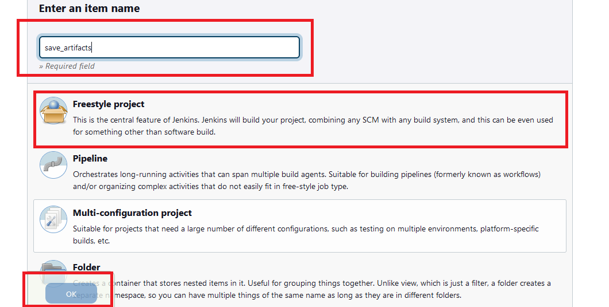
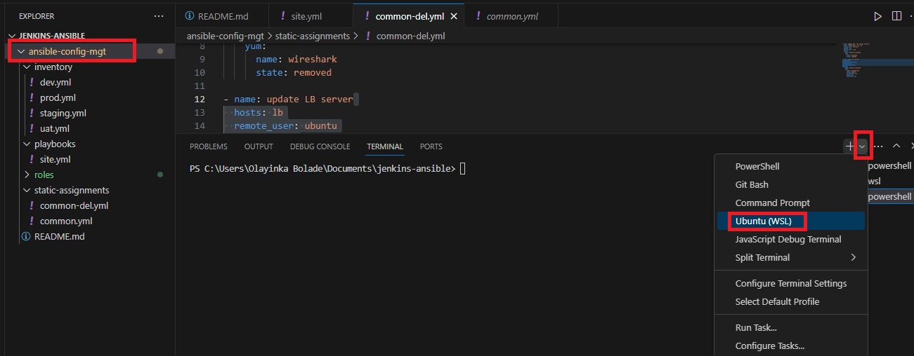
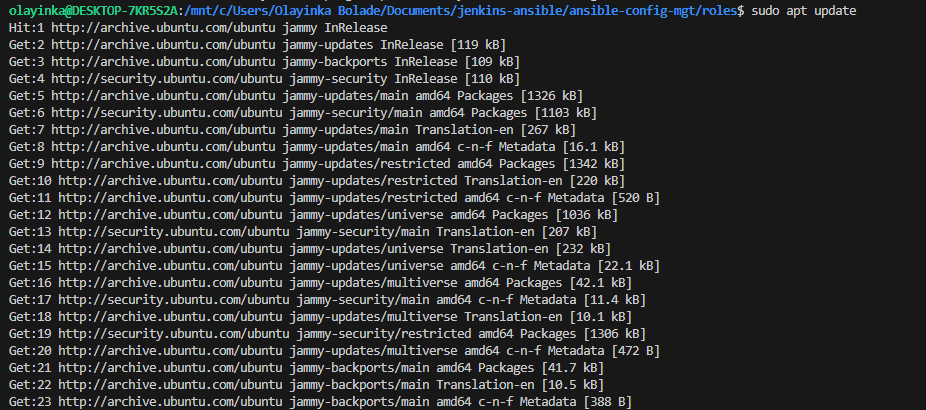
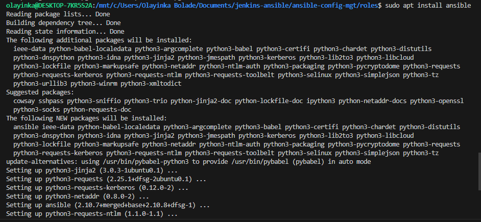
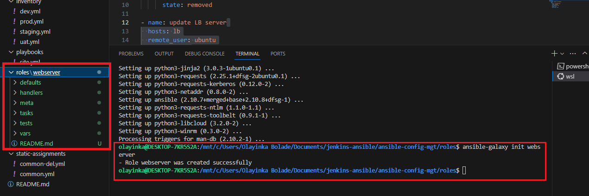
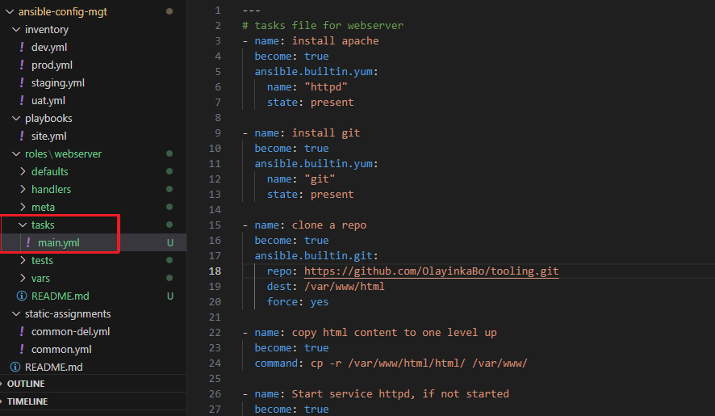
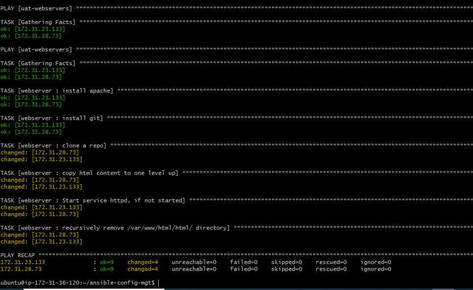
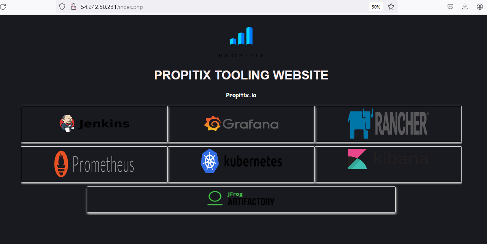
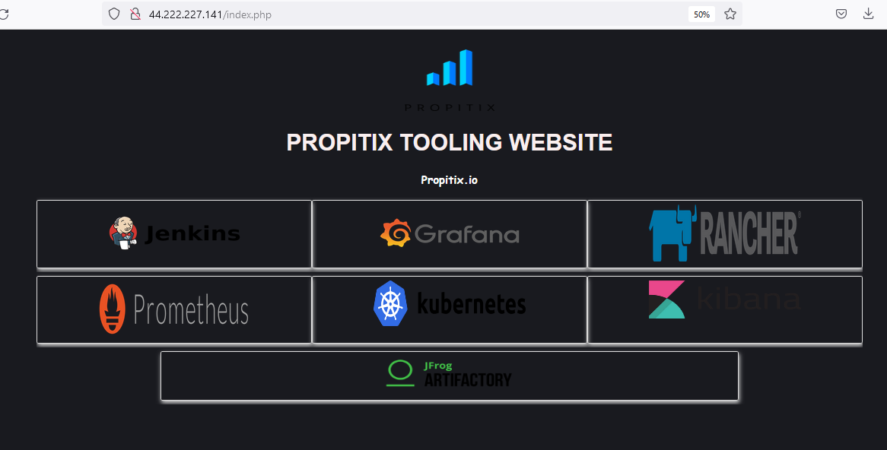

# Ansible Refactoring & Static Assignments (Imports and Roles)

In this project we will continue working with ansible-config-mgt repository and make some improvements of our code used in project 11. Now we need to refactor our Ansible code, create assignments, and learn how to use the imports functionality. Imports allow to effectively re-use previously created playbooks in a new playbook - it allows us to organize our tasks and reuse them when needed.

## Code Refactoring

Refactoring is a general term in computer programming. It means making changes to the source code without changing expected behaviour of the software. The main idea of refactoring is to enhance code readability, increase maintainability and extensibility, reduce complexity, add proper comments without affecting the logic.

In our case, we will move things around a little bit in the code, but the overal state of the infrastructure remains the same.

Let us see how we can improve our Ansible code!

## Step 1 - Jenkins job enhancement

Before we begin, let us make some changes to our Jenkins job - now every new change in the codes creates a separate directory which is not very convenient when we want to run some commands from one place. Besides, it consumes space on Jenkins server with each subsequent change. Let us enhance it by introducing a new Jenkins project/job - we will require [Copy Artifact](https://plugins.jenkins.io/copyartifact/) plugin.

1. Go to your Jenkins-Ansible server and create a new directory called ansible-config-artifact - we will store there all artifacts after each build.

`sudo mkdir /home/ubuntu/ansible-config-artifact`


2. Change permissions to this directory, so Jenkins could save files there.

`chmod -R 0777 /home/ubuntu/ansible-config-artifact`


3. Go to Jenkins web console -> Manage Jenkins -> Manage Plugins -> on `Available` tab search for `Copy Artifact` and install this plugin without restarting Jenkins.


4. Create a new Freestyle project and name it save_artifacts.


)

5. This project will be triggered by completion of your existing ansible project. Configure it accordingly:


**Note:** You can configure number of builds to keep in order to save space on the server, for example, you might want to keep only last 2 or 5 build results. You can also make this change to your ansible job.


6. The main idea of save_artifacts project is to save artifacts into /home/ubuntu/ansible-config-artifact directory. To achieve this, create a Build step and choose Copy artifacts from other project, specify ansible as a source project and /home/ubuntu/ansible-config-artifact as a target directory.


7. Test your set up by making some change in README.MD file inside your ansible-config-mgt repository (right inside main branch).


If both Jenkins jobs have completed one after another - you shall see your files inside /home/ubuntu/ansible-config-artifact directory and it will be updated with every commit to your main branch.


Now your Jenkins pipeline is more neat and clean.

## Step 2 - Refactor Ansible code by importing other playbooks into site.yml

Before starting to refactor the codes, ensure that you have pulled down the latest code from main branch, and create a new branch, name it refactor.


DevOps philosophy implies constant iterative improvement for better efficiency - refactoring is one of the techniques that can be used, but you always have an answer to question "why?". Why do we need to change something if it works well?

In Project 11 we wrote all tasks in a single playbook common.yml, now it is pretty simple set of instructions for only 2 types of OS, but imagine we have many more tasks and we need to apply this playbook to other servers with different requirements. In this case, we will have to read through the whole playbook to check if all tasks written there are applicable and is there anything that we need to add for certain server/OS families. Very fast it will become a tedious exercise and our playbook will become messy with many commented parts. Our DevOps colleagues will not appreciate such organization of your codes and it will be difficult for them to use your playbook.

Most Ansible users learn the one-file approach first. However, breaking tasks up into different files is an excellent way to organize complex sets of tasks and reuse them.

Let's see code re-use in action by importing other playbooks.

1. Within `playbooks` folder, create a new file and name it `site.yml` - This file will now be considered as an entry point into the entire infrastructure configuration. Other playbooks will be included here as a reference. In other words, `site.yml` will become a parent to all other playbooks that will be developed. Including `common.yml` that you created previously. 


2. Create a new folder in root of the repository and name it `static-assignments`. The static-assignments folder is where all other children playbooks will be stored. This is merely for easy organization of your work. It is not an Ansible specific concept, therefore you can choose how you want to organize your work.


3. Move common.yml file into the newly created static-assignments folder.


4. Inside site.yml file, import common.yml playbook.

```
- hosts: all
- import_playbook: ../static-assignments/common.yml
```


The code above uses built in import_playbook Ansible module.
Your folder structure should look like this;

```
├── static-assignments
│   └── common.yml
├── inventory
    └── dev
    └── stage
    └── uat
    └── prod
└── playbooks
    └── site.yml
```

5. Run ansible-playbook command against the dev environment


Since you need to apply some tasks to your dev servers and wireshark is already installed - you can go ahead and create another playbook under static-assignments and name it common-del.yml. In this playbook, configure deletion of wireshark utility.

```
- name: update web, nfs and db servers
  hosts: webservers, nfs, db
  remote_user: ec2-user
  become: yes
  become_user: root
  tasks:
  - name: delete wireshark
    yum:
      name: wireshark
      state: removed

- name: update LB server
  hosts: lb
  remote_user: ubuntu
  become: yes
  become_user: root
  tasks:
  - name: delete wireshark
    apt:
      name: wireshark-qt
      state: absent
      autoremove: yes
      purge: yes
      autoclean: yes
```

update `site.yml` with `- import_playbook: ../static-assignments/common-del.yml` instead of `common.yml` and run it against `dev` servers:


```
cd /home/ubuntu/ansible-config-mgt/

ansible-playbook -i inventory/dev.yml playbooks/site.yaml
```


Make sure that wireshark is deleted on all the servers by running wireshark --version

**web 1**


**web 2**


**nfs**


**db**


**lb**


Now you have learned how to use import_playbooks module and you have a ready solution to install/delete packages on multiple servers with just one command.


## Step 3 - Configure UAT Webservers with a role 'Webserver'

We have our nice and clean `dev` environment, so let us put it aside and configure 2 new Web Servers as `uat`. We could write tasks to configure Web Servers in the same playbook, but it would be too messy, instead, we will use a dedicated role to make our configuration reusable.

1. Launch 2 fresh EC2 instances using RHEL 9 image, we will use them as our `uat` servers, so give them names accordingly - `Web1-UAT` and `Web2-UAT`.


**Tip:** Do not forget to stop EC2 instances that you are not using at the moment to avoid paying extra. For now, you only need 2 new RHEL 9 servers as Web Servers and 1 existing `Jenkins-Ansible` server up and running.

2. To create a role, you must create a directory called roles/, relative to the playbook file or in /etc/ansible/ directory.

There are two ways how you can create this folder structure:

Use an Ansible utility called ansible-galaxy inside ansible-config-mgt/roles directory (you need to create roles directory upfront)

To create a role, you must create a directory called roles/, relative to the playbook file or in /etc/ansible/ directory.

There are two ways how you can create this folder structure:

Use an Ansible utility called ansible-galaxy inside ansible-config-mgt/roles directory (we need to create roles directory upfront)

- Open VS Code and ensure to change to `ansible-config-mgt` directory.
- Select Ubuntu (WSL) under terminal and then run the below command.
- Ensure to update the server and then install ansible before running the `ansible-galaxy init webserver` command.



```
mkdir roles
cd roles
ansible-galaxy init webserver
```








- Create the directory/files structure manually

**Note:** We can choose either way, but since ywe store all your codes in GitHub, it is recommended to create folders and files there rather than locally on `Jenkins-Ansible` server.

The entire folder structure should look like below, but if we create it manually - we can skip creating `tests`, `files`, and `vars` or remove them if we used `ansible-galaxy`

```
└── webserver
    ├── README.md
    ├── defaults
    │   └── main.yml
    ├── files
    ├── handlers
    │   └── main.yml
    ├── meta
    │   └── main.yml
    ├── tasks
    │   └── main.yml
    ├── templates
    ├── tests
    │   ├── inventory
    │   └── test.yml
    └── vars
        └── main.yml

```

After removing unnecessary directories and files, the roles structure should look like this:

```
└── webserver
    ├── README.md
    ├── defaults
    │   └── main.yml
    ├── handlers
    │   └── main.yml
    ├── meta
    │   └── main.yml
    ├── tasks
    │   └── main.yml
    └── templates
```

3. Update your inventory ansible-config-mgt/inventory/uat.yml file with IP addresses of your 2 UAT Web servers.

**NOTE:** Ensure to use ssh-agent to ssh into the Jenkins-Ansible instance just as we did in project 11;

To learn how to setup SSH agent and connect VS Code to your Jenkins-Ansible instance, please see this video:

- For Windows users - [ssh-agent on windows](https://www.youtube.com/watch?v=OplGrY74qog)

- For Linux users - [ssh-agent on linux](https://www.youtube.com/watch?v=OplGrY74qog)

```
[uat-webservers]

<Web1-UAT-Server-Private-IP-Address> ansible_ssh_user='ec2-user'

<Web2-UAT-Server-Private-IP-Address> ansible_ssh_user='ec2-user'
```


4. In `/etc/ansible/ansible.cfg` file uncomment roles_path string and provide a full path to your roles directory `roles_path    = /home/ubuntu/ansible-config-mgt/roles`, so Ansible could know where to find configured roles.


5. It is time to start adding some logic to the webserver role. Go into `tasks` directory, and within the `main.yml` file, start writing configuration tasks to do the following:

- Install and configure Apache (`httpd` service)
- Clone **Tooling website** from GitHub `https://github.com/<your-name>/tooling.git`.
- Ensure the tooling website code is deployed to `/var/www/html` on each of 2 UAT Web servers.
- Make sure `httpd` service is started.

Your main.yml may consist of following tasks:

```
---
- name: install apache
  become: true
  ansible.builtin.yum:
    name: "httpd"
    state: present

- name: install git
  become: true
  ansible.builtin.yum:
    name: "git"
    state: present

- name: clone a repo
  become: true
  ansible.builtin.git:
    repo: https://github.com/<your-name>/tooling.git
    dest: /var/www/html
    force: yes

- name: copy html content to one level up
  become: true
  command: cp -r /var/www/html/html/ /var/www/

- name: Start service httpd, if not started
  become: true
  ansible.builtin.service:
    name: httpd
    state: started

- name: recursively remove /var/www/html/html/ directory
  become: true
  ansible.builtin.file:
    path: /var/www/html/html
    state: absent
```



## Step 4 - Reference 'Webserver' role

Within the `static-assignments` folder, create a new assignment for **uat-webservers** `uat-webservers.yml`. This is where you will reference the role.

```
---
- hosts: uat-webservers
  roles:
     - webserver
```


Remember that the entry point to our ansible configuration is the `site.yml` file. Therefore, we need to refer our `uat-webservers.yml` role inside `site.yml`.
So, we should have this in `site.yml`

```
---
- hosts: all
- import_playbook: ../static-assignments/common.yml

- hosts: uat-webservers
- import_playbook: ../static-assignments/uat-webservers.yml
```


## Step 5 - Commit & Test

We will now commit our changes, create a Pull Request and merge them to master branch, making sure that webhook triggers two consequent Jenkins jobs, and run successfully while also copying all the files to our `Jenkins-Ansible` server into `/home/ubuntu/ansible-config-mgt/` directory.
Now let's run the playbook against our `uat` inventory and see what happens:


**NOTE:** Before running the playbook, ensure to have tunneled into the Jenkins-Ansible server via ssh-agent.


For windows users, see this [video](https://www.youtube.com/watch?v=OplGrY74qog)

For Linux users, see this [video](https://www.youtube.com/watch?v=RRRQLgAfcJw&list=PLtPuNR8I4TvlBxy8IUXUDnmtlKawRsWH_&index=16)

```
cd /home/ubuntu/ansible-config-mgt

 ansible-playbook -i /home/ubuntu/ansible-config-mgt/inventory/uat.yml /home/ubuntu/ansible-config-mgt/playbooks/site.yml
```



You should be able to see both of your UAT Web servers configured and you can try to reach them from your browser:

`http://<Web1-UAT-Server-Public-IP-or-Public-DNS-Name>/index.php`



or

`http://<Web1-UAT-Server-Public-IP-or-Public-DNS-Name>/index.php`



Our Ansible architecture now looks like this:


## Congratulations!

You have learned how to deploy and configure UAT Web Servers using Ansible imports and roles!

