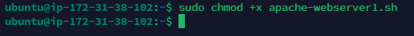
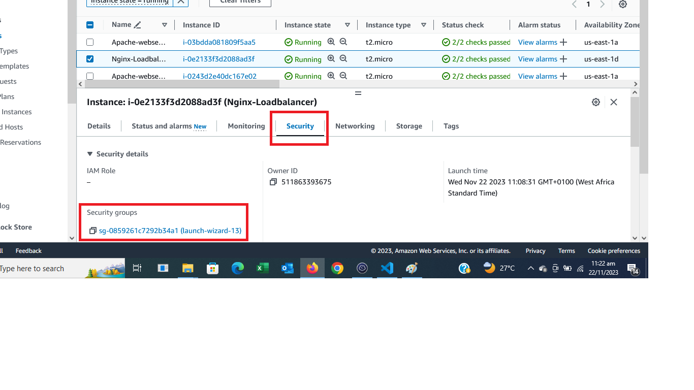
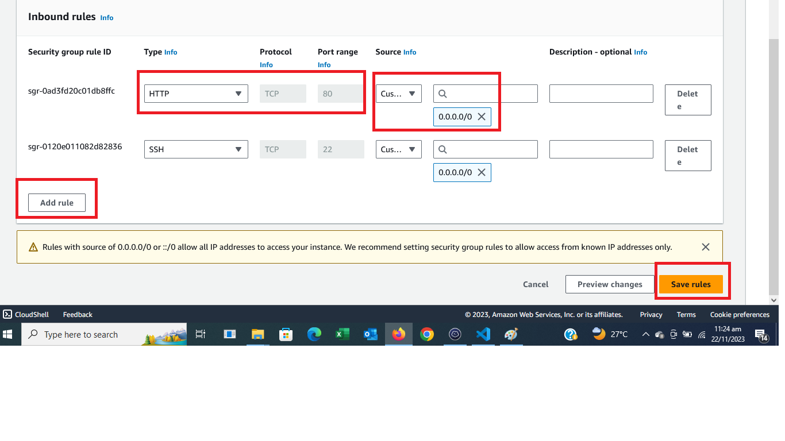
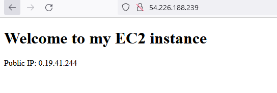
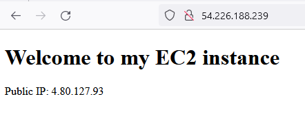

# Automating Load Balancer Configuration with Shell Scripting

 The process of manually setting up load balancers as described in the previous project might not be as tasking if we are only dealing with 2 or 3 servers. However, working on multiple servers could involve complex and repetitive tasks which will make manual process of configuration to not only be susceptible to errors but will also greatly reduce efficiency.

 To overcome this, we can streamline our load balancer configuration with ease using shell scripting and simple CICD on Jenkins. In this project, we will automate the set up and maintenance of our load balancer with shell scripting and jenkins.

 ## Automate the Deployment of Webservers

 In order to increase the speed of deployment, the entire process in the previous project will be automated. Instead of typing commands in our terminal to deploy 2 backend Apache servers with an Ngnix load balancer distributing traffic across the webservers, we will write a shell script that will automate the entire process.

 


## Deploying and Configuring the Webservers

The process to deploy our webservers have been codified in the shell script below :

```
#!/bin/bash

####################################################################################################################
##### This automates the installation and configuring of apache webserver to listen on port 8000
##### Usage: Call the script and pass in the Public_IP of your EC2 instance as the first argument as shown below:
######## ./install_configure_apache.sh 127.0.0.1
####################################################################################################################

set -x # debug mode
set -e # exit the script if there is an error
set -o pipefail # exit the script when there is a pipe failure

PUBLIC_IP=$1

[ -z "${PUBLIC_IP}" ] && echo "Please pass the public IP of your EC2 instance as an argument to the script" && exit 1

sudo apt update -y &&  sudo apt install apache2 -y

sudo systemctl status apache2

if [[ $? -eq 0 ]]; then
    sudo chmod 777 /etc/apache2/ports.conf
    echo "Listen 8000" >> /etc/apache2/ports.conf
    sudo chmod 777 -R /etc/apache2/

    sudo sed -i 's/<VirtualHost \*:80>/<VirtualHost *:8000>/' /etc/apache2/sites-available/000-default.conf

fi
sudo chmod 777 -R /var/www/
echo "<!DOCTYPE html>
        <html>
        <head>
            <title>My EC2 Instance</title>
        </head>
        <body>
            <h1>Welcome to my EC2 instance</h1>
            <p>Public IP: "${PUBLIC_IP}"</p>
        </body>
        </html>" > /var/www/html/index.html

sudo systemctl restart apache2
```

### Steps to Run the Shell Script


**Step 1 :** Launch an instance on AWS EC2. Select ubuntu 20.04, create your key pair and launch.


**Step 2 :**  Go to the security group and open port 8000 from anywhere to allow traffic.

 


**Step 3 :** Connect to the server via the SSH client


**Step 4 :** Open a file and paste the command above. Run the command above ensuring to replace the placeholder IP address:

`sudo vi file.sh`


To close the file press `esc` and the press `shift` + :wq!

**Step 5 :** Change the permission on the file to make it executable using the command below : 

`sudo chmod +x file.sh`



**Step 6 :** Run the shell script using the command below :

`./file.sh`


## Deployment of Nginx as a Load Balancer using Shell Script

Since we have successfully deployed and configured the two webservers, we shall now proceed to also install and configure the load balancer. 

As with the webservers, we need to launch an EC2 instance on AWS running on ubuntu 22.04. We the open port 80 anywhere using the security group and connect to load balancer via the terminal.

### Deploying and Configuring Mginx Load Balancer

The process to deploy and configure our load balancer is codified in the below shell script.

```
#!/bin/bash

######################################################################################################################
##### This automates the configuration of Nginx to act as a load balancer
##### Usage: The script is called with 3 command line arguments. The public IP of the EC2 instance where Nginx is installed
##### the webserver urls for which the load balancer distributes traffic. An example of how to call the script is shown below:
##### ./configure_nginx_loadbalancer.sh PUBLIC_IP Webserver-1 Webserver-2
#####  ./configure_nginx_loadbalancer.sh 127.0.0.1 192.2.4.6:8000  192.32.5.8:8000
############################################################################################################# 

PUBLIC_IP=$1
firstWebserver=$2
secondWebserver=$3

[ -z "${PUBLIC_IP}" ] && echo "Please pass the Public IP of your EC2 instance as the argument to the script" && exit 1

[ -z "${firstWebserver}" ] && echo "Please pass the Public IP together with its port number in this format: 127.0.0.1:8000 as the second argument to the script" && exit 1

[ -z "${secondWebserver}" ] && echo "Please pass the Public IP together with its port number in this format: 127.0.0.1:8000 as the third argument to the script" && exit 1

set -x # debug mode
set -e # exit the script if there is an error
set -o pipefail # exit the script when there is a pipe failure


sudo apt update -y && sudo apt install nginx -y
sudo systemctl status nginx

if [[ $? -eq 0 ]]; then
    sudo touch /etc/nginx/conf.d/loadbalancer.conf

    sudo chmod 777 /etc/nginx/conf.d/loadbalancer.conf
    sudo chmod 777 -R /etc/nginx/

    
    echo " upstream backend_servers {

            # your are to replace the public IP and Port to that of your webservers
            server  "${firstWebserver}"; # public IP and port for webserser 1
            server "${secondWebserver}"; # public IP and port for webserver 2

            }

           server {
            listen 80;
            server_name "${PUBLIC_IP}";

            location / {
                proxy_pass http://backend_servers;   
            }
    } " > /etc/nginx/conf.d/loadbalancer.conf
fi

sudo nginx -t

sudo systemctl restart nginx
```

### Steps to Run the Shell Script


**Step 1 :** Launch an instance on AWS EC2. Select ubuntu 20.04, create your key pair and launch.


**Step 2 :**  Go to the security group and open port 80 from anywhere to allow traffic.





**Step 3 :** Connect to the server via the SSH client


**Step 4 :** Open a file and paste the command above. Run the command above ensuring to replace the placeholder IP addresses:

`sudo vi nginx-loadbalancer.sh`


To close the file press `esc` and the press `shift` + :wq!

**Step 5 :** Change the permission on the file to make it executable using the command below : 

`sudo chmod +x nginx-loadbalancer.sh`


**Step 6 :** Run the shell script using the command below :

`./nginx-loadbalancer.sh 54.226.188.239 50.19.41.244:8000 54.80.127.93:8000`


## Verifying the Setup

### Screenshot for webserver one


### Screenshot for webserver two


### Screenshot for the loadbalancer






# Thank you!