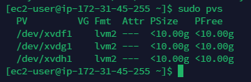
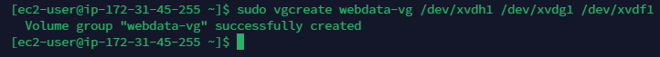
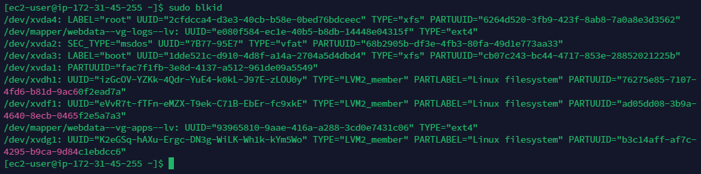
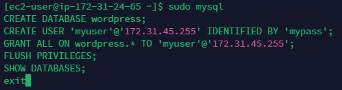

# Implementing Wordpress Website with LVM Storage Management

Welcome to implementing wordpress website with LVM Storage Management on AWS EC2 Redhat course. If you are eager to learn how to implement wordpress website with LVM Storage Management on AWS EC2 then this course is for you. This course takes you through step by step implemetaion of wordpress website with LVM Storage Management using Redhat as the operating system.

### Course Objectives

By the end of this project, you would have gained the requisite knowlwdge listed below:

* Develeop the knowledge and skills to succesfully implement and manage a wordpress website on AWS EC2 using the LVM Storage Management.

* Whether you are aspiring to be a website developer, a system administrator or a Devops professional, you will learn to leverage the power of AWS cloud infrastructure to build scalable and reliable wordpress sites. 

* You will learn how to create logical volumes, manage disk space and dynamicallly adjust volumes to accommodate changing storage requirements.

* You will gain the proficiency to install and configure wordpress, install themes and add essential plugins to enhance your website's functionality.

* You will learn performance optimization techniques and best practices for securing your Wordpress installation on the AWS cloud.

## Understanding 3 Tier Architechture

### Web Solution with Wordpress


WordPress is a content management system (CMS) that allows you to host and build websites. WordPress contains plugin architecture and a template system, so you can customize any website to fit your business, blog, portfolio, or online store. 

It is a free and open-source content management system written in PHP and paired with MySQL or MariaDB as its backend Relational Database Management System (RDBMS). 

This project consists of two parts:

 * Configure storage subsystem for Web and Database servers based on Linux OS. The focus of this part is to give you practical experience of working with disks, partitions and volumes in Linux.

* Install WordPress and connect it to a remote MySQL database server. This part of the project will solidify your skills of deploying Web and DB tiers of Web solution.

As a DevOps engineer, a deep understanding of core components of web solutions and the ability to troubleshoot them will play essential role in your further progress and development.


### Three-tier Architecture


Generally, web, or mobile solutions are implemented based on what is called the Three-tier Architecture.

Three-tier Architecture is a client-server software architecture pattern that comprise of 3 separate layers. They are:

1. Presentation Layer (PL): This is the user interface such as the client server or browser on your laptop.
    
2. Business Layer (BL): This is the backend program that implements business logic. Application or Webserver
    
3. Data Access or Management Layer (DAL): This is the layer for computer data storage and data access. Database Server or File System Server such as FTP server, or NFS Server.

With this project, you will have the hands-on experience that showcases Three-tier Architecture while also ensuring that the disks used to store files on the Linux servers are adequately partitioned and managed through programs such as gdisk and LVM respectively.

**Requirements:**

Your 3-Tier Setup

1. A Laptop or PC to serve as a client
2. An EC2 Linux Server as a web server (This is where you will install WordPress)
3. An EC2 Linux server as a database (DB) server.

Note: We are using RedHat OS for this project, click on this [link](https://github.com/OlayinkaBo/DevOps_Pro/tree/main/PROJECT3) to learn how to spin up an EC2 server if you don't already know how to do so.

 Also when connecting to RedHat you will need to use ec2-user user. Connection string will look like ec2-user@public-ip-address.

 ## Implementing LVM on  Linux Servers (Web and Database Servers)

 **Step 1 : Prepare a Web server**

 1. Launch an EC2 instance that will serve as web server. Create 3 volumes of 10GiB each in the same AZ (Availability Zone) as the web server. 

 Learn how to attach EBS volumes to an EC2 instance [here](https://www.youtube.com/watch?v=HPXnXkBzIHw)

 


2. Attach all three volumes one by one to your Web Server EC2 instance.


3. Open up the Linux terminal to begin configuration.


4. Use lsblk command to inspect what block devices are attached to the server. Notice names of your newly created devices. All devices in Linux reside in /dev/ directory. Inspect it with ls /dev/ and make sure you see all 3 newly created block devices there - their names will likely be xvdf, xvdh, xvdg.


4. Use df -h command to see all mounts and free space on your server


5. Use gdisk utility to create a single partition on each of the 3 disks.

`sudo gdisk /dev/xvdf`

 Follow the below steps :

   * Run sudo gdisk /dev/xvdf

   * Run a new entry by entering n and click the number of partition in this case 1

   * click yes to complete the process.


6. Use lsblk utility to view the newly configured partition on each of the 3 disks.


7. To install lvm2 package use `sudo yum install lvm2`. 


* To check for available partitions in the disk, run `sudo lvmdiskscan` command 


8. To mark each of 3 disks as physical volumes (PVs) to be used by LVM, run `pvcreate` command for each of the 3 volumes created. 
```
sudo pvcreate /dev/xvdf1
sudo pvcreate /dev/xvdg1
sudo pvcreate /dev/xvdh1
```


9. To verify that your Physical volume has been created successfully, run `sudo pvs`



10. Use `vgcreate` utility to add all 3 PVs to a volume group (VG) and name the VG webdata-vg

`sudo vgcreate webdata-vg /dev/xvdh1 /dev/xvdg1 /dev/xvdf1`



11. To verify that your VG has been created successfully, run `sudo vgs`


12. Next we need to create 2 logical volumes using `lvcreate` .  apps-lv will use half of the PV size while logs-lv Use the remaining space of the PV size. NOTE: apps-lv will be used to store data for the Website while, logs-lv will be used to store data for logs.

```
sudo lvcreate -n apps-lv -L 14G webdata-vg
sudo lvcreate -n logs-lv -L 14G webdata-vg
```


13. To verify that your Logical Volume has been created successfully, run `sudo lvs` command


14. To verify the entire setup, run

```
sudo vgdisplay -v #view complete setup - VG, PV, and LV
sudo lsblk 
```


15. Use mkfs.ext4 to format the logical volumes with ext4 filesystem.

```
sudo mkfs -t ext4 /dev/webdata-vg/apps-lv
sudo mkfs -t ext4 /dev/webdata-vg/logs-lv
```


16. Create /var/www/html directory to store website files

`sudo mkdir -p /var/www/html`


17. Create /home/recovery/logs to store backup of log data

`sudo mkdir -p /home/recovery/logs`


18. Mount /var/www/html on apps-lv logical volume

`sudo mount /dev/webdata-vg/apps-lv /var/www/html/`


19. Use rsync utility to backup all the files in the log directory /var/log into /home/recovery/logs (This is required before mounting the file system)

`sudo rsync -av /var/log/. /home/recovery/logs/`


20. Mount /var/log on logs-lv logical volume. (Note that all the existing data on /var/log will be deleted. That is why step 19 above is very important).

`sudo mount /dev/webdata-vg/logs-lv /var/log`


21. Restore log files back into /var/log directory

`sudo rsync -av /home/recovery/logs /var/log`


22. Update /etc/fstab file so that the mount configuration will persist after restart of the server.

The UUID of the  device will be used to update the /etc/fstab file;

`sudo blkid`



`sudo vi /etc/fstab`


Update /etc/fstab in this format using your own UUID and rememeber to remove the leading and ending quotes.

23. Test the configuration and reload the daemon

```
sudo mount -a
sudo systemctl daemon-reload
```


Verify your setup by running `df -h` output must look like this:


**Step 2 — Prepare the Database Server**

Launch a second RedHat EC2 instance that will have a role - 'DB Server'
Repeat the same steps as for the Web Server, but instead of `apps-lv` create `db-lv` and mount it to `/db` directory instead of `/var/www/html/`.

* create 3 volumes for the database server


* Run `lsblk` to see the newly created volumes


To create a single partition on each of the 3 disks

    Run sudo gdisk /dev/xvdf
    Run sudo gdisk /dev/xvdg
    Run sudo gdisk /dev/xvdh


* Install the lvm2 package by runnning 

`sudo yum install lvm2`

* Mark each of the three disks as physical Volumes(Pvs) to be used by LVM. To do this we run the blow commands :

```
sudo pvcreate /dev/xvdf1
sudo pvcreate /dev/xvdg1
sudo pvcreate /dev/xvdh1
```


To add all the three Physical volumes(Pvs) to a Volume Group(VG). Name the VG webdata-vg. Run

`sudo vgcreate webdata-vg /dev/xvdh1 /dev/xvdg1 /dev/xvdf1`


* Verify that your VG has been created successfully by running `sudo vgs`


To create 2 logical volumes `db-lv` (Use half of the Pv size), and `logs-lv` (Use the remaining space of the PV)

Note; db-lv will be used to store data for the website while,logs-lv will be used to store data for logs. Run 

```
sudo lvcreate -n db-lv -L 14G webdata-vg
sudo lvcreate -n logs-lv -L 14G webdata-vg
```


To format the logical Volumes with ext4 file system using mkfs.ext4. Run

```
sudo mkfs -t ext4 /dev/webdata-vg/db-lv
sudo mkfs -t ext4 /dev/webdata-vg/logs-lv
```


* To create /db directory to store websites file, run 

`sudo mkdir -p /db`

To create /home/recovery/logs to store back up of the logs data, run 

`sudo mkdir -p /home/recovery/logs`

* To mount /db on db-lv logical volume, run 

`sudo mount /dev/webdata-vg/db-lv /db`


To back up files in the log directory /var/log into home/recovery/logs using the rsync utility, run 

`sudo rsync -av /var/log/. /home/recovery/logs/`


To mount var/log on logs-lv logical volume, run 

`sudo mount /dev/webdata-vg/logs-lv /var/log`


* To restore log files back into /var/log directory, run

`sudo rsync -av /home/recovery/logs /var/log`


* Update /etc/fstab file so that the mount configuration will persist after restart of the server.

The UUID of the  device will be used to update the /etc/fstab file;

`sudo blkid`


* Run `sudo vi /etc/fstab` 

Update /etc/fstab in this format using your own UUID and rememeber to remove the leading and ending quotes.


* Test the configuration and reload the daemon

```
sudo mount -a
sudo systemctl daemon-reload
```


* Verify your setup by running df -h, output must look like this:


**Step 3 — Install Wordpress on your Web Server EC2**

1. Update the repository if you haven't done so already. 

`sudo yum -y update`


2. Install wget, Apache and it's dependencies

`sudo yum -y install wget httpd php php-mysqlnd php-fpm php-json`


3. Start Apache

```
sudo systemctl start httpd

sudo systemctl enable httpd
```


4. To install PHP and it's depemdencies, run the below commands

```
sudo yum install https://dl.fedoraproject.org/pub/epel/epel-release-latest-8.noarch.rpm
sudo yum install yum-utils http://rpms.remirepo.net/enterprise/remi-release-8.rpm
sudo yum module list php
sudo yum module reset php
sudo yum module enable php:remi-7.4
sudo yum install php php-opcache php-gd php-curl php-mysqlnd
sudo systemctl start php-fpm
sudo systemctl enable php-fpm
sudo setsebool -P httpd_execmem 1
```


5. Restart Apache

`sudo systemctl restart httpd`


6. Download wordpress and copy wordpress to `var/www/html`

```
mkdir wordpress
cd   wordpress
sudo wget http://wordpress.org/latest.tar.gz
sudo tar xzvf latest.tar.gz
sudo rm -rf latest.tar.gz
cp wordpress/wp-config-sample.php wordpress/wp-config.php
cp -R wordpress /var/www/html/
```


7. Configure SELinux Policies. Run the below command :

```
 sudo chown -R apache:apache /var/www/html/wordpress
 sudo chcon -t httpd_sys_rw_content_t /var/www/html/wordpress -R
 sudo setsebool -P httpd_can_network_connect=1
```


**Step 4 — Install MySQL on your DB Server EC2**
```
sudo yum update
sudo yum install mysql-server
```


Verify that the service is up and running by using sudo systemctl status mysqld, if it is not running, restart the service and enable it so it will be running even after reboot:

```
sudo systemctl restart mysqld
sudo systemctl enable mysqld
```


**Step 5 — Configure DB to work with WordPress**

```
sudo mysql
CREATE DATABASE wordpress;
CREATE USER 'myuser'@'<Web-Server-Private-IP-Address>' IDENTIFIED BY 'mypass';
GRANT ALL ON wordpress.* TO 'myuser'@'<Web-Server-Private-IP-Address>';
FLUSH PRIVILEGES;
SHOW DATABASES;
exit
```



**Step 6 — Configure WordPress to connect to remote database.**

Hint: Do not forget to open MySQL port 3306 on DB Server EC2. For extra security, you shall allow access to the DB server ONLY from your Web Server's IP address, so in the Inbound Rule configuration specify source as /32


1. Install MySQL client and test that you can connect from your Web Server to your DB server by using mysql-client.

```
sudo yum install mysql
sudo mysql -u admin -p -h <DB-Server-Private-IP-address>
```


2. Verify if you can successfully execute `SHOW DATABASES;` command and see a list of existing databases.


3. Enable TCP port 80 in Inbound Rules configuration for your Web Server EC2 (enable from everywhere 0.0.0.0/0 or from your workstation's IP)


4. Try to access from your browser the link to your WordPress http://<Web-Server-Public-IP-Address>/wordpress/

If it does not work, you can go to the directory /var/www/html/wordpress and edit the file `wp-config.php`


Refresh the url to load wordpress page


# END OF PROJECT
